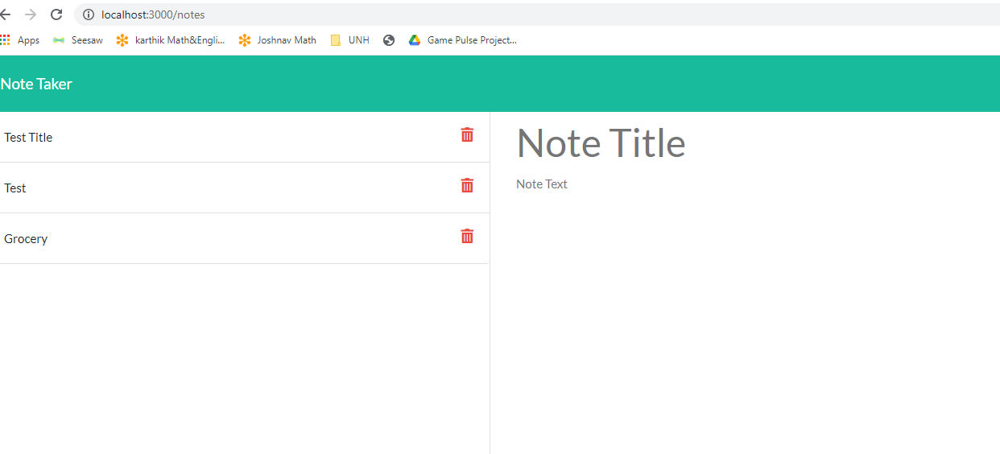

#  Note Taker

## Your Task

Task is to create an application called Note Taker that can be used to write and save notes. This application will use an Express.js back end and will save and retrieve note data from a JSON file.

As the application’s front end has already been created. Our job is to build the back end, connect the two, and then deploy the entire application to Heroku.

## User Story

```
AS a small business owner
I want to be able to write and save notes
So that I can organize my thoughts and keep track of tasks I need to complete.
```

## Acceptance Criteria

```
Given a note-taking application

1.When I open the Note Taker,then I am presented with a landing page with a link to a notes page.

2.When I click on the link to the notes page,then I am presented with a page with existing notes listed in the left-hand column, plus empty fields to enter a new note title and the note’s text in the right-hand column.

3.When I enter a new note title and the note’s text,then a Save icon appears in the navigation at the top of the page.

4.When I click on the Save icon,then the new note I have entered is saved and appears in the left-hand column with the other existing notes.

5.When I click on an existing note in the list in the left-hand column,then that note appears in the right-hand column.

6.When I click on the Write icon in the navigation at the top of the page,then I am presented with empty fields to enter a new note title and the note’s text in the right-hand column
```

## Mock-Up

The following image shows a mock-up of the generated appearance and functionality:



## Link to the recording video


## Github link
https://github.com/swethareddyl/Note-Taker